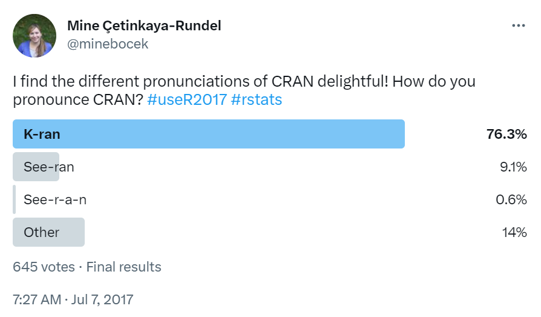

```{r load-packages, include = FALSE}
# Add any additional packages you need to this chunk
library(tidyverse)
#library(palmerpenguins)
#library(knitr)
library(xaringanthemer)
```
```{r xaringan-themer, include=FALSE, warning=FALSE}
library(xaringanthemer)
library(fontawesome)
library(kableExtra)
style_mono_accent(
  #base_color = "#1e90ff",
  base_font_size = "25px",
  header_font_google = google_font("Roboto Slab", "400", "700"),
  header_font_weight = "400",
  link_color = "#887ba3",
  text_bold_color = "#B56B6F"
  #text_font_google   = google_font("Montserrat", "300", "300i"),
  #code_font_google   = google_font("Fira Mono")
)
```


```{r, include = F}
# This is the recommended set up for flipbooks
# you might think about setting cache to TRUE as you gain practice --- building flipbooks from scratch can be time consuming
knitr::opts_chunk$set(fig.width = 9, message = FALSE, warning = FALSE, comment = "", cache = T)
library(flipbookr)
library(tidyverse)
library(rmarkdown)
```


name: xaringan-title
class: center, middle
background-image: url(img/packagesmall.png)
background-size: 15%
background-position: right 20% bottom 3%

<style>
    h1.small {
       font-size: 60px;
}
    h3.small {
       font-size: 40px;
}
</style>

<h1 style="color: #43418A;" class = "small">Submitting your R package to CRAN</h1>

<!--  -->

<h3 style="color: #43418A;" class = "small">Ying Li | WCM Computing Club | April 14, 2023</h3>

<br>
<br>
<br>
<br>
<br>
---
# Step 0: Preparation

In this step, you should have:

--

- An **R package** (including R, man, data, NAMESPACE, DESCRIPTION, etc.)

--

- Start R studio within your **package directory**

--

- A **GitHub repository** of your package (not necessary but Recommend)   
  + e.g. [rapidphylo](https://github.com/ArindamRoyChoudhury/rapidphylo) by Dr. Arindam RoyChoudhury

<br>
--

.footnote[See WCM Computing Club Resources: [How to build a package in R](https://wcm-computing-club.github.io/file_slides/2019/201901_Lee_R_Package.pdf) by Dr. Jihui Lee]

---

# Step 1: Read CRAN Policies

.pull-left[

- It's good to read the CRAN policies before submitting your package to confirm that you are in compliance with CRAN policies.

- The link to CRAN policies page:
https://cran.r-project.org/web/packages/policies.html
]


.pull-right[
  
]


---
# Step 2: Check documentation

Create your package pdf manual: 
```{r eval=FALSE, tidy=FALSE}
devtools::build_manual(path = "...") 
```

You can use `path` argument to specify the path in which to produce package manual.

This pdf manual includes information in both DESCRIPTION file and function documentation. So, you can check all documentation in one file.

.footnote[[Example: CRAN page of rapidphylo](https://cran.r-project.org/web/packages/rapidphylo/index.html)]

---
# Step 2: Check documentation

--

Checklist of DESCRIPTION file:

--

- Correct **email address** of Maintainer

--

- Correct **version number**

--

- Correct URL (a link to GitHub repo of your package if you have)

--

- Correct BugReports (a link to "issues" in the GitHub repo of your package if you have) 

.footnote[[Guide of version number](https://r-pkgs.org/lifecycle.html#sec-lifecycle-release-type)]
---
# Step 3: Check package 

--

To submit your package to CRAN, you need to run **R CMD check**. 

R CMD check runs all sorts of checks on the contents of an R package. 

It returns **Warnings**, **Errors** and **Notes** messages. 
--

- Fix all ERRORs and WARNINGs from R CMD check

--

- Eliminate as many NOTEs as possible

--

## How to perform R CMD check?

---
# Step 3: Check package

There are several ways to run R CMD check, here are a few recommendations

- Use devtools or rhub to check for CRAN specific requirements. R-hub will send an email with the results to the package maintainer. You can change it using `email` argument.

```{r eval=FALSE, tidy=FALSE}
rhub::check_for_cran(email = 'yil4013@med.cornell.edu')
devtools::check_rhub()
```

- Use devtools to build and check your package, using all known best practices

```{r eval=FALSE, tidy=FALSE}
devtools::check()
```

**Reminder**: The Working Directory should be **within your package directory** 

---
# Step 3: Check package 

Here are some other simple checks that can help you discover potential errors or warnings.

.pull-left[
- Check your examples in your manuals
```{r eval=FALSE, tidy=FALSE}
devtools::run_examples()
```

- Check spell on text fields

```{r eval=FALSE, tidy=FALSE}
devtools::spell_check()
```

]

.pull-right[
- Check package dependencies 
```{r eval=FALSE, tidy=FALSE}
inteRgrate::check_pkg()
```

- Check if code adheres to standards
```{r eval=FALSE, tidy=FALSE}
inteRgrate::check_lintr() 
```

]

---
# Step 3: Check package

.pull-left[

- Check that your package is ok on windows. Result will be sent to Maintainer's email. To use other email, set `email = "your email" `

```{r eval=FALSE, tidy=FALSE}
devtools::check_win_devel()
```

- Check if your description is tidy 


```{r eval=FALSE, tidy=FALSE}
inteRgrate::check_tidy_description() 
```


]

.pull-right[

- Check that downstream dependencies (i.e. all packages that **list your package** in the `Depends`, `Imports`, `Suggests` or `LinkingTo` fields) continue to work

```{r eval=FALSE, tidy=FALSE}
devtools::revdep_check()
```

- Make your DESCRIPTION  file tidy

```{r eval=FALSE, tidy=FALSE}
usethis::use_tidy_description() 
```

]


---
# Step 4: Edit cran-comment.md

--

`cran-comments.md` is a file to record comments about a submission, mainly the results from R CMD check and revdep checks. You can explain for notes that can't be eliminated in R CMD check.

--

I prefer generating `cran-comments.md` by hand, but you can also create it using function:

```{r eval=FALSE, tidy=FALSE}
usethis::use_cran_comments()
```

Note: There will always be one NOTE when you first submit your package. You **can’t** eliminate that NOTE, so just mention in `cran-comments.md` that this is your first submission.

.footnote[[Example: rapidphylo/cran-comments.md](https://github.com/ArindamRoyChoudhury/rapidphylo/blob/main/cran-comments.md)]
---
# Step 5: Edit NEWS.md

`NEWS.md` is used to keep track of changes of your package.

You can generate it by hand or using R function: 
```{r eval=FALSE, tidy=FALSE}
usethis::use_news_md()
```

You can record any changes to your package, like Bug fixes, New features, and Enhancements. etc.

.footnote[
[Example: rapidphylo/NEWS.md](https://github.com/ArindamRoyChoudhury/rapidphylo/blob/main/NEWS.md)

[Further reading: Maëlle Salmon](https://blog.r-hub.io/2020/05/08/pkg-news/)]

---
# Step 6: Submit

--

Option 1: Submit your package via the CRAN's [web form](https://xmpalantir.wu.ac.at/cransubmit/). 

--

Option 2: Submit in R or R studio using R function. (Recommend)

```{r eval=FALSE, tidy=FALSE}
devtools::release() 
```

`r emo::ji("arrow_right")` The maintainer will receive an email containing a confirmation link from CRAN within a few minutes.

`r emo::ji("arrow_right")` Click the link and complete confirmation. 

`r emo::ji("tada")` **ALL DONE!!**


---
# Step 6: Submit

What happens next: 

- The maintainer will recieve an email showing if your package pass the CRAN team's **auto-check** service. 
 + If NO, modify your package and submit it again. 
 
 + If YES, a CRAN team member will typically respond to you within 10 working days.

- CRAN will notify you by email once your package is accepted.

---
# Thank you!

<br>

Resource:

[R-package-devel mailing list](https://stat.ethz.ch/mailman/listinfo/r-package-devel) by r-package-devel-owner

[Releasing to CRAN](https://r-pkgs.org/release.html) by Hadley Wickham and Jennifer Bryan 


[How to write your own R package and publish it on CRAN](https://www.mzes.uni-mannheim.de/socialsciencedatalab/article/r-package/) by MZES Social Science Data Lab 

[Checklist for r package (re-)submissions on cran](https://www.marinedatascience.co/blog/2020/01/09/checklist-for-r-package-re-submissions-on-cran/) by  SASKIA O.
